# TokensBruecke — Figma plugin

<a href="https://www.figma.com/community/plugin/1254538877056388290" target="_blank">
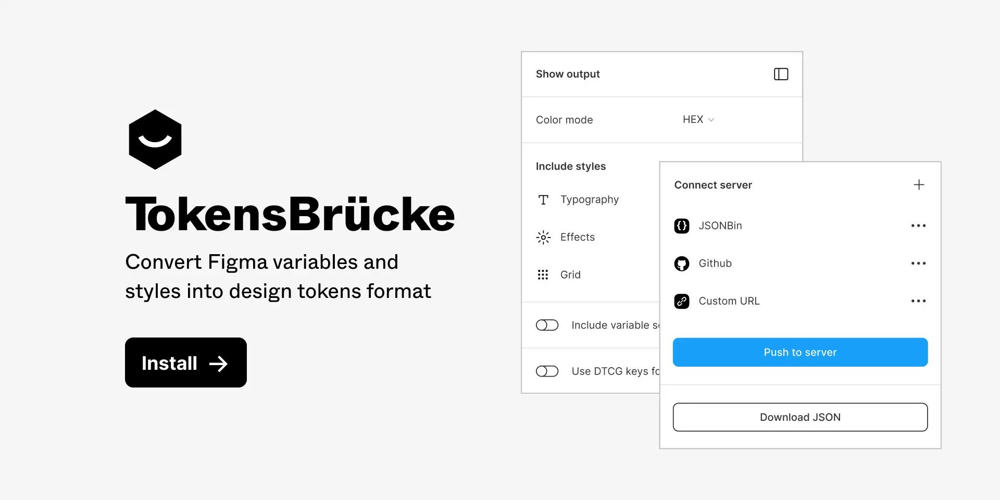
</a>

## What is this plugin for?

The plugin converts Figma variables into design-tokens JSON that are compatible with the [DTCG 2025.10 specification](https://www.designtokens.org/tr/2025.10/format/).

---

## Table of contents

- [TokensBruecke — Figma plugin](#tokensbruecke--figma-plugin)
  - [What is this plugin for?](#what-is-this-plugin-for)
  - [Table of contents](#table-of-contents)
  - [How to use](#how-to-use)
    - [Export and Import](#export-and-import)
      - [Export (Variables → JSON)](#export-variables--json)
      - [Import (JSON → Variables)](#import-json--variables)
  - [General settings](#general-settings)
    - [Color mode](#color-mode)
    - [Include styles](#include-styles)
    - [Add styles to](#add-styles-to)
    - [Include variable scopes](#include-variable-scopes)
    - [Use percentage for opacity](#use-percentage-for-opacity)
    - [Expand easing presets to cubic-bezier](#expand-easing-presets-to-cubic-bezier)
    - [DTCG 2025.10 format](#dtcg-202510-format)
    - [Include `.value` string for aliases](#include-value-string-for-aliases)
    - [Include Figma metadata](#include-figma-metadata)
    - [Split collections into separate files](#split-collections-into-separate-files)
    - [Split modes into separate files](#split-modes-into-separate-files)
    - [Omit collection names](#omit-collection-names)
  - [Use as cli tool](#use-as-cli-tool)
    - [Installation](#installation)
    - [Usage](#usage)
    - [Quick setup](#quick-setup)
    - [Options](#options)
    - [Snapshot input](#snapshot-input)
    - [CLI Configuration File](#cli-configuration-file)
    - [For AI agents](#for-ai-agents)
      - [Agentic usage without the REST API](#agentic-usage-without-the-rest-api)
  - [Push to server](#push-to-server)
    - [JSONBin](#jsonbin)
    - [GitHub](#github)
    - [GitHub PR](#github-pr)
    - [GitLab](#gitlab)
    - [Custom server](#custom-server)
  - [Show output](#show-output)
  - [Plugin window height](#plugin-window-height)
  - [Multiple profiles](#multiple-profiles)
  - [Config autosaving](#config-autosaving)
  - [Styles support](#styles-support)
    - [Typography](#typography)
    - [Colors](#colors)
    - [Grids](#grids)
    - [Shadows](#shadows)
    - [Blur](#blur)
    - [Multiple `Shadow` and `Blur` styles support](#multiple-shadow-and-blur-styles-support)
  - [Tokens structure](#tokens-structure)
  - [Aliases handling](#aliases-handling)
    - [Include `.value` string for aliases](#include-value-string-for-aliases-1)
    - [Color aliases with opacity](#color-aliases-with-opacity)
    - [Handle variables from another file](#handle-variables-from-another-file)
    - [Handle modes](#handle-modes)
  - [Variables types conversion](#variables-types-conversion)
  - [Motion variables](#motion-variables)
  - [Design tokens types](#design-tokens-types)
  - [Scopes lemitations](#scopes-lemitations)
  - [Privacy and analytics](#privacy-and-analytics)
  - [Feedback](#feedback)

---

## How to use

1. Install the plugin from the [Figma Community](https://www.figma.com/community/plugin/1254538877056388290).
2. Make sure you have variables in your Figma file.
3. Run the plugin.
4. Adjust the settings.
5. Then you can download the JSON file or push it to on of the [supported services](#link).

### Export and Import

The plugin supports both **exporting** and **importing** design tokens:

#### Export (Variables → JSON)

- Click **"Download JSON"** to export your Figma variables as a design tokens JSON file
- The exported file is compatible with the [DTCG 2025.10 specification](https://www.designtokens.org/tr/2025.10/format/)
- You can also push directly to supported services (JSONBin, GitHub, GitLab, etc.)
- The exported tokens can be converted into CSS, JS, and other platform formats using tools like [Terrazzo](https://terrazzo.app/docs/) or [Style Dictionary](https://amzn.github.io/style-dictionary/)

#### Import (JSON → Variables)

- Click **"Import JSON"** to import design tokens from a JSON file back into Figma
- The plugin will create variable collections, modes, and variables based on the JSON structure
- Supports both DTCG format (`$value`, `$type`) and standard format (`value`, `type`)
- Handles alias references between variables
- Creates new collections and variables as needed, or updates existing ones

**Import Features:**

- ✅ Creates variable collections from top-level objects
- ✅ Supports multiple modes (from `$extensions.mode` or `extensions.mode`)
- ✅ Handles all variable types (color, number, string, boolean, timing, easing)
- ✅ Resolves alias references between variables
- ✅ Supports various color formats (HEX, RGBA CSS, RGBA Object)
- ✅ Preserves variable descriptions and metadata
- ✅ Imports `duration` and `cubicBezier` tokens as Figma motion variables (see [Motion variables](#motion-variables))

> [!WARNING]  
> **Styles Export Limitation**: If you exported tokens with styles included (typography, grids, shadows, or blur), these cannot be imported back as Figma styles or variables. Figma's variable API currently only supports basic types: `color`, `number`, `string`, `boolean`, `dimension`, `duration` and `cubicBezier`. Complex style types will be imported as `STRING` variables without proper value conversion. This is a temporary limitation until Figma supports these types natively in their API.

---

## General settings

### Color mode

Allows you to choose the color mode for the generated JSON. Default value is `HEX`. The plugin supports the following color modes:

- `HEX` — HEX color format. Could be converted into `HEXA` if the color has an alpha channel.
- `RGBA CSS` — RGBA color format in CSS syntax, e.g. `rgba(0, 0, 0, 0.5)`. When alpha is `1`, the output is `rgb(r, g, b)` (no alpha channel).
- `RGBA Object` — RGBA color format in object syntax, e.g. `{ r: 0, g: 0, b: 0, a: 0.5 }`.
- `sRGB DTCG` — sRGB color format in object syntax matching the [DTCG specification](https://www.designtokens.org/tr/2025.10/color/#srgb)
- `HSLA CSS` — HSLA color format in CSS syntax, e.g. `hsla(0, 0%, 0%, 0.5)`.
- `HSLA Object` — HSLA color format in object syntax, e.g. `{ h: 0, s: 0, l: 0, a: 0.5 }`.
- `HSL DTCG` — HSL color format in object syntax matching the [DTCG specification](https://www.designtokens.org/tr/2025.10/color/#hsl)
- `OKLCH DTCG` — OKLCH color format in object syntax matching the [DTCG specification](https://www.designtokens.org/tr/2025.10/color/#oklch)

### Include styles

Allows you to include styles into the generated JSON. See more about styles support in the [Styles support](#styles-support) section.

There is an option to rename each style's group and give it a custom name for better organization.

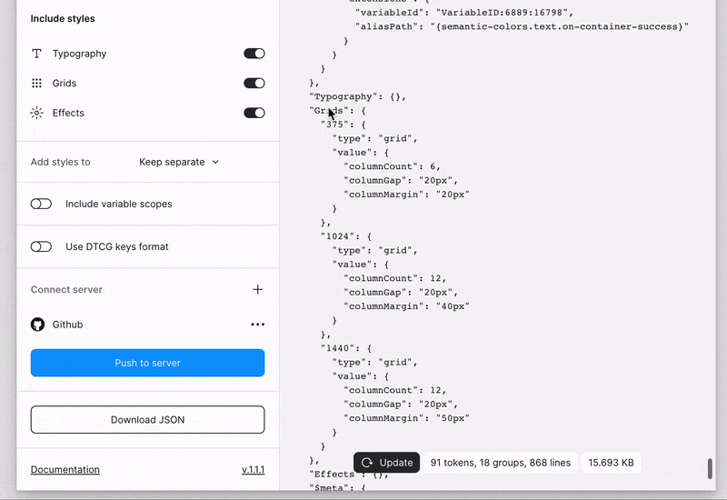

### Add styles to

Allows you to choose where to put styles in the generated JSON. By default, the selected value is `Keep separate`. In this case styles will be added into the root of the JSON and will be treated as collections. There is also an option to add styles into the corresponding collection (fig.4).

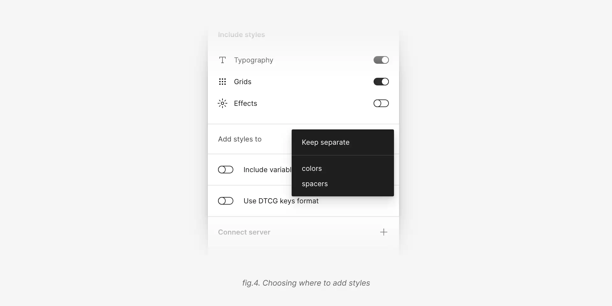

### Include variable scopes

Each Figma variable has a [scope property](https://www.figma.com/plugin-docs/api/VariableScope). The plugin allows you to include scopes into the generated JSON. It will be included as an array of strings without any transformations.

```json
{
  "button": {
    "background": {
      "type": "color",
      "value": "#000000",
      "scopes": ["ALL_SCOPES"]
    }
  }
}
```

### Use percentage for opacity

Is `off` by default. When enabled, opacity values will be exported as percentages instead of normalized decimal values. This affects variables with the `OPACITY` scope.

```json
// Without percentage format (default)
{
  "opacity": {
    "type": "number",
    "value": 0.1
  }
}

// With percentage format
{
  "opacity": {
    "type": "string",
    "value": "10%"
  }
}
```

### Expand easing presets to cubic-bezier

Is `on` by default. Figma's `EASING` variables hold either a custom curve or one of Figma's named presets, and the API only returns numbers for the custom ones — a preset arrives as just its name.

When enabled, the named bezier presets (Linear, Ease in, Ease out, Ease in and out and the three "back" variants) are expanded into their curve, so every bezier easing exports as a spec-valid `cubicBezier` token. When disabled, they keep the name Figma gave them.

```json
// Expanded (default)
{
  "easing": {
    "$type": "cubicBezier",
    "$value": [0.41, 0, 1, 1]
  }
}

// Not expanded
{
  "easing": {
    "$type": "string",
    "$value": "ease-in"
  }
}
```

Custom beziers always export as `cubicBezier` and are unaffected by this setting.

Spring presets (Gentle, Quick, Bouncy, Slow), custom springs and Hold are always exported as strings regardless of the setting — DTCG has no spring type, and Figma exposes no curve to expand a spring into. See [Motion variables](#motion-variables) for the full mapping.

### DTCG 2025.10 format

Is `on` by default. Aligns the output with the [DTCG 2025.10 specification](https://www.designtokens.org/tr/2025.10/format/):

- All token keys are prefixed with the `$` symbol (`$value`, `$type`, `$description`).
- Dimensions are exported as objects per [§8.2 Dimension](https://www.designtokens.org/tr/2025.10/format/#dimension) — `{ "value": 6, "unit": "px" }` instead of `"6px"`. This also applies to sub-values in shadows, typography, and grids.
- `$type` is omitted for Figma `STRING` and `BOOLEAN` variables, since those aren't part of the DTCG type set. The original Figma type is preserved under the token's `$extensions.figmaType`.
- The root `$extensions["tokens-bruecke-meta"]` includes a `spec` field with the canonical spec URL, so downstream tools know which format to expect.

```json
// Off — native Figma format
{
  "button": {
    "background": {
      "type": "color",
      "value": "#000000"
    },
    "height": {
      "type": "dimension",
      "value": "32px"
    }
  }
}

// On — DTCG 2025.10 format
{
  "button": {
    "background": {
      "$type": "color",
      "$value": "#000000"
    },
    "height": {
      "$type": "dimension",
      "$value": { "value": 32, "unit": "px" }
    }
  }
}
```

> [!NOTE]
> Values that have no valid DTCG representation stay as strings even with this setting on: percentage-based `lineHeight`/`letterSpacing` (e.g. `"150%"`) and `"auto"` line height. `blur` and `grid` style tokens are exported with non-spec `$type` values as documented in [Styles support](#styles-support).

### Include `.value` string for aliases

Is `off` by default. Allows you to include `.value` string to the end of the path for aliases. It will be added to the alias string.

```json
{
  "button": {
    "background": {
      "type": "color",
      "value": "{colors.light.primary.10.value}"
    }
  }
}
```

If the format is `DTCG`:

```json
{
  "button": {
    "background": {
      "$type": "color",
      "$value": "{colors.light.primary.10.$value}"
    }
  }
}
```

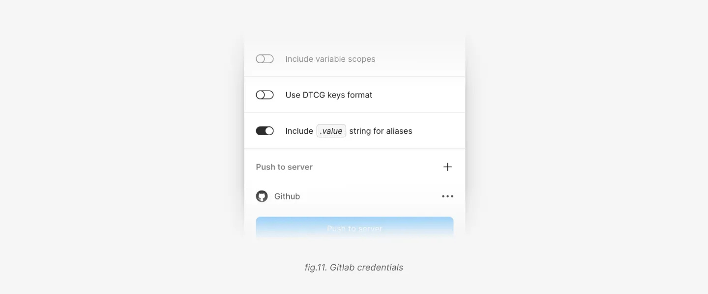

### Include Figma metadata

Is `off` by default. Allows you to include Figma metadata like `variableId`, `codeSyntax`, etc. into the generated JSON. It is merged into the existing `$extensions` object alongside `mode`.

```json
"button": {
  "background": {
    "type": "color",
    "value": "{colors.primary.10}",
    "$extensions": {
      "mode": {
        "light": "{colors.primary.10}",
        "dark": "{colors.primary.90}"
      },
      "figma": {
        "codeSyntax": {},
        "variableId": "VariableID:1:4",
        "collection": {
          "id": "VariableCollectionId:1:3",
          "name": "Primitives",
          "defaultModeId": "1:0"
        }
      }
    }
  }
}
```

### Split collections into separate files

Is `off` by default. When enabled, each Figma variable collection is exported as its own file instead of a single merged JSON.

- **Download JSON** — produces a `design.tokens.zip` archive containing one `{CollectionName}.tokens.json` per collection.
- **CLI** — writes individual `{CollectionName}.tokens.json` files into the directory specified by `--output`.
- **Push to a server** — the GitHub, GitHub PR and GitLab servers commit one `{CollectionName}.tokens.json` per collection in a single commit. The `File name` field of the server becomes the folder they are written into, e.g. `tokens` → `tokens/{CollectionName}.tokens.json`.

This is useful when you want to keep component-level token files separate (e.g. `button.tokens.json`, `card.tokens.json`).

### Split modes into separate files

Is `off` by default. When enabled, each mode of a variable collection is exported as its own file. The top-level key in each file is the collection name, and every token's value is resolved for that mode.

- **Download JSON** — produces a `design.tokens.zip` archive containing one `{CollectionName}/{ModeName}.tokens.json` per mode.
- **CLI** — writes individual `{CollectionName}/{ModeName}.tokens.json` files into the directory specified by `--output`.
- **Push to a server** — the GitHub, GitHub PR and GitLab servers commit one `{CollectionName}/{ModeName}.tokens.json` per mode in a single commit, inside the folder set in the server's `File name` field.

Collections with a single mode are exported as a single `{CollectionName}.tokens.json` file.

For example, a collection `color` with modes `light` and `dark` produces `color/light.tokens.json` and `color/dark.tokens.json`:

```json
// color/light.tokens.json
{
  "color": {
    "primary": { "$type": "color", "$value": "#ffffff" }
  }
}

// color/dark.tokens.json
{
  "color": {
    "primary": { "$type": "color", "$value": "#000000" }
  }
}
```

This is useful for generating a [resolver.json](https://www.designtokens.org/tr/drafts/resolver/) file that references per-mode token files.

### Omit collection names

Is `off` by default. When enabled, the plugin drops the top-level collection name from the output and merges all variables into a single flat namespace (variables are still grouped by the `/` separator in their names).

```json
// Without "Omit collection names" (default)
{
  "Primitives": {
    "color": {
      "primary": { "type": "color", "value": "#000000" }
    }
  },
  "Semantic": {
    "button": {
      "background": { "type": "color", "value": "{color.primary}" }
    }
  }
}

// With "Omit collection names"
{
  "color": {
    "primary": { "type": "color", "value": "#000000" }
  },
  "button": {
    "background": { "type": "color", "value": "{color.primary}" }
  }
}
```

Alias references are also rewritten so they point to the flat path (the collection prefix is removed).

> [!WARNING]  
> If two variables in different collections share the same name, the last one wins and a collision warning is logged to the console. Rename conflicting variables (or keep this option off) to avoid losing values.

---

## Use as cli tool

The CLI is published on npm: [tokens-bruecke](https://www.npmjs.com/package/tokens-bruecke)

The CLI can get its data two ways:

- **From the Figma REST API** — pass `--file-key` and a token. Requires a Figma Enterprise plan.
- **From a local snapshot** — pass `--input`. No token, no Enterprise plan; see [Snapshot input](#snapshot-input).

Both modes produce identical output and share every other flag.

> [!WARNING]  
> ⚠️ You need a Figma Enterprise plan to use the Figma REST API for variables. Use `--input` if you don't have one.

### Installation

To install the CLI globally, run:

```bash
pnpm add -g tokens-bruecke
#or npm install -g tokens-bruecke
```

This will make the `tokens-bruecke` command available globally on your system.

### Usage

After installation, you can run the CLI tool using:

```bash
tokens-bruecke [options]
```

For example:

```bash
# Using a Personal Access Token (PAT)
tokens-bruecke --api-key $FIGMA_TOKEN --file-key $FIGMA_FILE --config config.json --output out/tokens.json

# Using an OAuth token
tokens-bruecke --oauth-token $FIGMA_OAUTH_TOKEN --file-key $FIGMA_FILE --config config.json --output out/tokens.json

# From a local snapshot — no token required
tokens-bruecke --input snapshot.json --output out/tokens.json
```

This will fetch figma variables and export them in `out/tokens.json`

### Quick setup

`tokens-bruecke init` asks a few questions and writes a config file you can commit:

```bash
tokens-bruecke init
```

```
? Color mode (↑↓ to move, enter to select)
❯ HEX          "#3366ff"
  RGBA CSS     "rgba(51, 102, 255, 1)"
  RGBA Object  { r, g, b, a }
  sRGB DTCG    DTCG color object
  HSLA CSS     "hsla(225, 100%, 60%, 1)"
  HSLA Object  { h, s, l, a }
  HSL DTCG     DTCG color object
  OKLCH DTCG   DTCG color object

? Styles to include (space to toggle, a for all, enter to confirm)
❯ ◉ Color styles
  ◯ Typography styles
  ◉ Effect styles
  ◯ Grid styles
```

Each answered question collapses to a single line, so you end up with a short summary rather than a wall of text:

```
? Color mode › OKLCH DTCG
? Styles to include › Color styles, Effect styles
? Use DTCG 2025.10 format? › No
? Output layout › One file per collection

✨ Created tokens-bruecke.config.json
```

**Keys:** `↑`/`↓` (or `j`/`k`, or `Tab`) to move, `1`–`9` to jump straight to a row, `Space` to toggle in multi-select, `a` to toggle all, `Enter` to confirm, `Ctrl+C` / `Esc` to cancel without writing anything. Selection wraps at both ends. Set `NO_COLOR=1` to drop the colour codes.

The four questions cover the settings people change most often, but the generated file contains **every** option with its default, plus a `$schema` link — so your editor autocompletes and documents the rest as you edit it.

| Option    | Alias | Description                                               |
| --------- | ----- | --------------------------------------------------------- |
| `--yes`   | `-y`  | Skip the questions and write the default config           |
| `--force` |       | Overwrite an existing config file                         |
| `--path`  | `-p`  | Where to write it (default: `tokens-bruecke.config.json`) |

When stdin is not a terminal — CI, a pipe, an agent — `init` skips the questions and writes the defaults instead of hanging.

### Options

| Option                    | Alias | Description                                                                                                | Required                                                |
| ------------------------- | ----- | ---------------------------------------------------------------------------------------------------------- | ------------------------------------------------------- |
| `--api-key`               | `-a`  | Figma personal access token (PAT)                                                                          | One of `--api-key` or `--oauth-token`, unless `--input` |
| `--oauth-token`           | `-t`  | Figma OAuth token                                                                                          | One of `--api-key` or `--oauth-token`, unless `--input` |
| `--file-key`              | `-f`  | Figma file key                                                                                             | Yes, unless `--input` is used                           |
| `--input`                 | `-i`  | Read a local tokens snapshot instead of calling the REST API (`-` reads stdin)                             | No                                                      |
| `--output`                | `-o`  | Path to output file, or output directory when `--split-by-collection` or `--split-by-mode`                 | Yes, unless `--stdout` is used                          |
| `--stdout`                |       | Print tokens JSON to stdout instead of writing a file (mutually exclusive with `--output` and split flags) | No                                                      |
| `--config`                | `-c`  | Path to configuration file                                                                                 | No                                                      |
| `--split-by-collection`   | `-s`  | Write each collection as a separate `.tokens.json` file in `--output`                                      | No                                                      |
| `--split-by-mode`         | `-m`  | Write each mode as a separate `.tokens.json` file under its collection directory in `--output`             | No                                                      |
| `--omit-collection-names` |       | Drop top-level collection names and merge all variables into one flat namespace                            | No                                                      |
| `--quiet`                 | `-q`  | Suppress progress logs (errors are still printed)                                                          | No                                                      |
| `--help`                  | `-h`  | Show usage help                                                                                            | No                                                      |
| `--version`               |       | Show the CLI version                                                                                       | No                                                      |

Progress logs are printed to **stderr**, so stdout stays clean for piping:

```bash
tokens-bruecke -a $FIGMA_TOKEN -f $FIGMA_FILE --stdout --quiet | jq .
```

Every option can also be set via a `FIGMA_`-prefixed environment variable — `FIGMA_API_KEY`, `FIGMA_OAUTH_TOKEN`, `FIGMA_FILE_KEY`, `FIGMA_OUTPUT`, etc. Explicit flags override environment variables:

```bash
export FIGMA_API_KEY=<your-token>
tokens-bruecke -f $FIGMA_FILE -o out/tokens.json
```

> [!TIP]
> For automated pipelines, `--oauth-token` is preferred over `--api-key`. Personal Access Tokens expire every 90 days and require manual renewal, while OAuth tokens support programmatic refresh for indefinite access.

Other export settings are available through a JSON configuration file (see [CLI Configuration File](#cli-configuration-file) below).

### Snapshot input

`--input <path>` transforms a local JSON snapshot of a Figma file's variables and styles instead of calling the REST API. `--input -` reads stdin, so it composes with anything that can dump the data:

```bash
# From a file
tokens-bruecke --input snapshot.json --output out/tokens.json

# From a pipe
my-figma-dumper | tokens-bruecke --input - --stdout --quiet > tokens.json
```

This is the path for **agents and plugins running inside Figma**: they already have Plugin API access to the open file, so they can dump the local variables and styles and pipe them straight through — no personal access token, and no Enterprise plan.

Snapshot mode ignores the `FIGMA_API_KEY` / `FIGMA_FILE_KEY` environment variables. Passing `--api-key`, `--oauth-token` or `--file-key` explicitly alongside `--input` is an error. Everything else — `--config`, `--split-by-collection`, `--split-by-mode`, `--omit-collection-names`, `--stdout` — behaves exactly as it does in REST mode.

#### Snapshot shape

Objects use the **raw Figma Plugin API shapes, verbatim** — serialize what the API returns rather than reshaping it, so nothing is lost in translation:

```js
const snapshot = {
  variableCollections: await figma.variables.getLocalVariableCollectionsAsync(),
  variables: await figma.variables.getLocalVariablesAsync(),
  paintStyles: await figma.getLocalPaintStylesAsync(),
  textStyles: await figma.getLocalTextStylesAsync(),
  effectStyles: await figma.getLocalEffectStylesAsync(),
  gridStyles: await figma.getLocalGridStylesAsync(),
};
```

Only `variables` and `variableCollections` are required; the style arrays are optional and read only when the matching `includedStyles.*` config flag is on. The full contract is in [schemas/tokens-snapshot.schema.json](schemas/tokens-snapshot.schema.json), with a ready-to-copy example in [examples/tokens-snapshot.json](examples/tokens-snapshot.json).

Things worth knowing when building a snapshot:

- `valuesByMode` is keyed by **`modeId`**, not mode name — names come from the collection's `modes` array.
- Colors are 0..1 float channels (`{ r, g, b, a }`), as the Plugin API returns them.
- `collection.variableIds` preserves the ordering shown in Figma's Variables panel.
- Aliases are `{ "type": "VARIABLE_ALIAS", "id": "…" }` and must point at a variable present in the snapshot; otherwise the value exports as `"#missing#"`, matching the REST behaviour for unresolvable references.
- Color aliases with their own opacity come back from the Plugin API as `{ "type": "VARIABLE_EXPRESSION", "expressionFunction": "COMPOSE_COLOR", "expressionArguments": [<alias or rgba>, <0..100 or alias>] }` — pass them through as-is, see [Color aliases with opacity](#color-aliases-with-opacity).

> [!NOTE]
> Plugin API objects are live proxies, so `JSON.stringify` may not enumerate their properties. Copy the fields listed in the schema onto plain objects before serializing.

### CLI Configuration File

You can use a JSON configuration file to specify the export options for the CLI. Run [`tokens-bruecke init`](#quick-setup) to generate one, or write it by hand:

```json
{
  "includedStyles": {
    "text": { "isIncluded": true, "customName": "typography" },
    "effects": { "isIncluded": false, "customName": "effects" },
    "grids": { "isIncluded": false, "customName": "grids" },
    "colors": { "isIncluded": false, "customName": "colors" }
  },
  "includeScopes": true,
  "useDTCG": true, // DTCG 2025.10 format: $-prefixed keys, dimension objects, spec-valid types
  "includeValueStringKeyToAlias": true,
  "includeFigmaMetaData": false, // Include Figma metadata like styleId, variableId, etc.
  "usePercentageOpacity": false, // Export opacity as percentage (10%) instead of decimal (0.1)
  "expandEasingPresets": true, // Expand Figma's named easing presets into cubicBezier values
  "colorMode": "hex", // "hex"  | "rgba-object"  | "srgb-dtcg" |  "rgba-css"  | "hsla-object" | "hsl-dtcg" | "hsla-css" | "oklch-dtcg";
  "storeStyleInCollection": "none", // Name of one of your collection or "none" to keep them separated
  "splitByCollection": false, // Write each collection as a separate .tokens.json file
  "splitByMode": false, // Write each mode as a separate .tokens.json file under its collection directory
  "omitCollectionNames": false // Drop top-level collection names and merge all variables into one flat namespace
}
```

Save this JSON file and pass it to the CLI using the `--config` option. A JSON schema with all options, types and defaults is available at [schemas/cli-options.schema.json](schemas/cli-options.schema.json) — reference it via a `$schema` key for editor validation and autocompletion (see [examples/cli-options.json](examples/cli-options.json)).

> [!NOTE]
> Explicit CLI flags (e.g. `--split-by-collection`) override values from the config file, which override the defaults.

### For AI agents

This repository and the npm package ship agent-friendly docs:

- [llms.txt](llms.txt) — entry point for LLM-based tools
- [skills/tokens-bruecke/SKILL.md](skills/tokens-bruecke/SKILL.md) — an [agent skill](https://code.visualstudio.com/docs/copilot/customization/agent-skills) covering CLI usage, auth, config and exit codes; copy the `skills/tokens-bruecke` folder into your project's skills directory to teach your agent the CLI
- [schemas/cli-options.schema.json](schemas/cli-options.schema.json) — machine-readable config schema
- [schemas/tokens-snapshot.schema.json](schemas/tokens-snapshot.schema.json) — machine-readable input schema for `--input`

For scripted/agent usage prefer `--stdout --quiet` (pure JSON on stdout, logs on stderr) and pass tokens via environment variables.

#### Agentic usage without the REST API

If your agent can run code inside Figma — a Figma agent, an MCP server with `evaluate_script`, or your own plugin — it already has Plugin API access to the open file. In that case it should **not** go through the REST API at all:

|                                                | REST API (`--file-key`) | Snapshot (`--input`)                |
| ---------------------------------------------- | ----------------------- | ----------------------------------- |
| Figma Enterprise plan                          | Required                | Not required                        |
| Personal access / OAuth token                  | Required                | Not required                        |
| File must be published / shared with the token | Yes                     | No — works on whatever file is open |
| Network calls                                  | Several per export      | None                                |

The agent's job is only to dump data; the CLI still owns every transform, so aliases, modes, scopes and DTCG formatting behave exactly as they do in REST mode.

**1. Extract the snapshot from inside Figma.** Plugin API objects are live proxies, so `JSON.stringify` on them may serialize as empty — copy the fields onto plain objects first:

```js
const snapshot = {
  variableCollections: (
    await figma.variables.getLocalVariableCollectionsAsync()
  ).map((c) => ({
    id: c.id,
    name: c.name,
    defaultModeId: c.defaultModeId,
    modes: c.modes.map((m) => ({ modeId: m.modeId, name: m.name })),
    variableIds: c.variableIds,
  })),
  variables: (await figma.variables.getLocalVariablesAsync()).map((v) => ({
    id: v.id,
    name: v.name,
    variableCollectionId: v.variableCollectionId,
    resolvedType: v.resolvedType,
    description: v.description,
    scopes: v.scopes,
    codeSyntax: v.codeSyntax,
    valuesByMode: v.valuesByMode,
  })),
  // Optional — only needed if the config enables the matching style type
  paintStyles: (await figma.getLocalPaintStylesAsync()).map((s) => ({
    id: s.id,
    name: s.name,
    description: s.description,
    paints: s.paints,
    boundVariables: s.boundVariables,
  })),
};

const json = JSON.stringify(snapshot, null, 2);
```

Text, effect and grid styles follow the same pattern — see [schemas/tokens-snapshot.schema.json](schemas/tokens-snapshot.schema.json) for the fields each one needs.

**2. Pipe it through the CLI.**

```bash
# From a file the agent wrote
npx tokens-bruecke --input snapshot.json --output tokens.json

# Or straight from stdin, no temp file
my-figma-agent dump-tokens | npx tokens-bruecke --input - --stdout --quiet > tokens.json

# All the usual options still apply
npx tokens-bruecke --input snapshot.json --config config.json --split-by-mode --output ./tokens
```

Snapshot mode ignores `FIGMA_API_KEY` / `FIGMA_FILE_KEY`, so a token exported in the environment won't get in the way. Passing `--api-key`, `--oauth-token` or `--file-key` explicitly alongside `--input` is rejected as a conflict.

On a bad snapshot the CLI exits `1` and names the offending key — for example `variables[3] is missing a string "variableCollectionId"` — so an agent can correct its dump and retry without guesswork.

> [!NOTE]
> Aliases pointing at variables outside the snapshot (typically library variables from another file) export as `"#missing#"`, the same as in REST mode. To resolve them, include those variables in the `variables` array.

---

## Push to server

With this feature you can connect a server and push the generated JSON directly to it. At the moment the plugin supports [JSONBin](https://jsonbin.io), [GitHub](https://github.com) and custom servers.

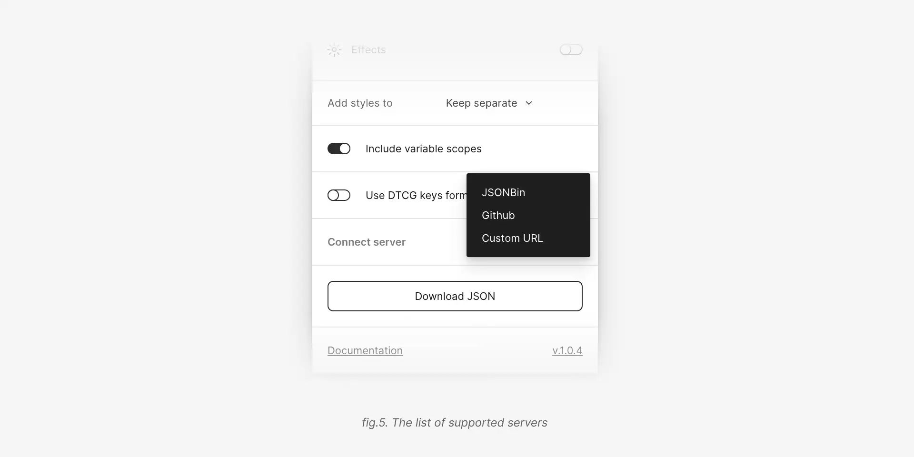

If you connected multiple servers, the plugin will try to push the tokens to all of them one by one.
In ordere to test if your credentials are valid you can make a test request by clicking the `Push to server` button (fig.6).

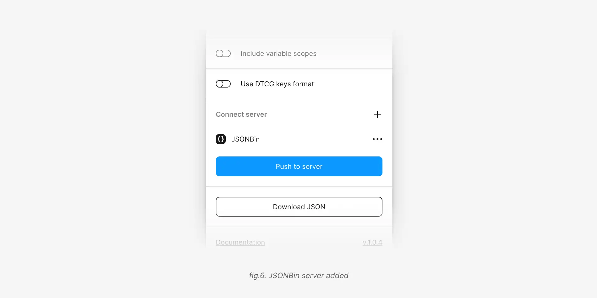

### [JSONBin](https://jsonbin.io)

1. Open [JSONBin](https://jsonbin.io) and create an account.
2. Generate a [new API key](https://jsonbin.io/api-reference/access-keys/create).
3. If you want to use an existing bin, copy its ID. Otherwise just leave the ID field empty in the plugin settings.
4. Add a name for the bin.

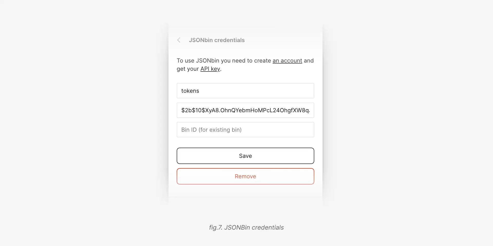

### [GitHub](https://github.com)

1. You need to create a [personal access token](https://docs.github.com/en/github/authenticating-to-github/creating-a-personal-access-token) with `repo` scope.
2. In the plugin settings paste the token into the `Personal access token` field.
3. Add an owner name, repository name and a branch name.
4. In the file name field you can specify a path to the file. If the file doesn't exist, it will be created. If the file exists, it will be overwritten. File name should include the file extension, e.g. `tokens.json`.
5. You can also specify a commit message.

> **Splitting into several files.** If _Split collections into separate files_ or _Split modes into separate files_ is enabled in the advanced settings, the file name field is treated as a folder instead, and every file is written in a single commit — e.g. `tokens` → `tokens/Colors.tokens.json`, or `tokens/Colors/Light.tokens.json` when splitting by mode.

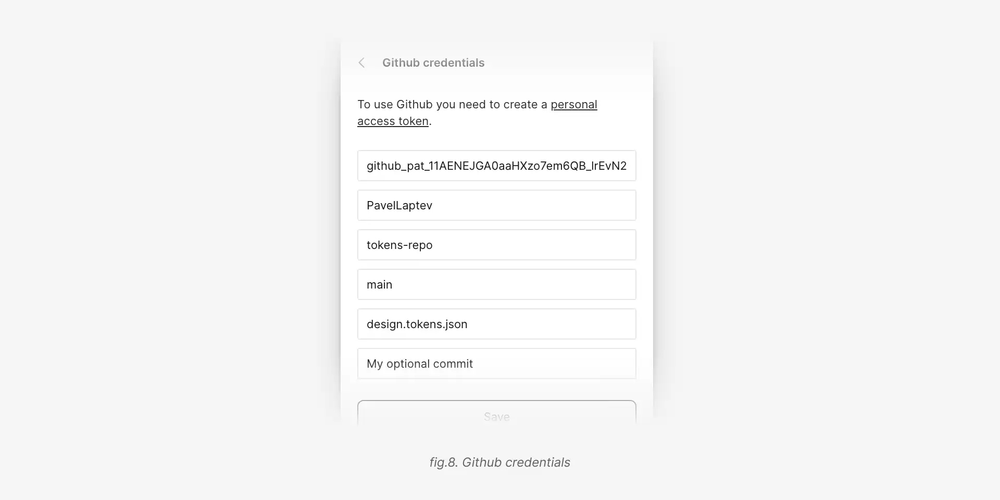

### [GitHub PR](https://github.com)

All the steps are the same as for the [GitHub](#github) server, except the last two.

- **PR title**. You can specify a title for the PR. If you leave it empty, the plugin will use `chore(tokens): update tokens` as a default title.
- **PR body**. You can specify a body for the PR. If you leave it empty, the plugin won't add any body to the PR.

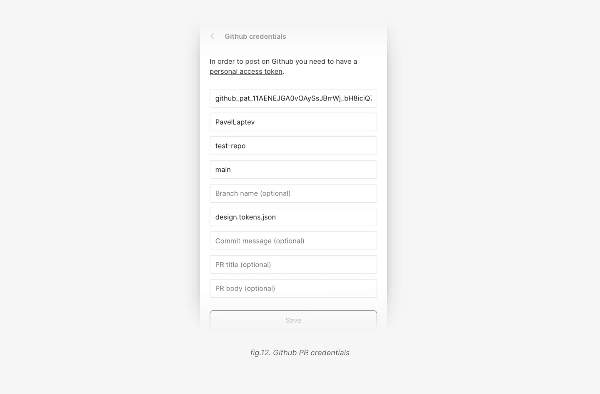

### [GitLab](https://gitlab.com)

1. You need to create a [project access token](https://docs.gitlab.com/ee/user/project/settings/project_access_tokens.html) with `api` scope.
2. In the plugin settings paste the token into the `Project access token` field.
3. Add an owner name, repository name and a branch name.
4. In the file name field you can specify a path to the file. If the file doesn't exist, it will be created. If the file exists, it will be overwritten. File name should include the file extension, e.g. `tokens.json`.
5. You can also specify a commit message.

> **Splitting into several files.** If _Split collections into separate files_ or _Split modes into separate files_ is enabled in the advanced settings, the file name field is treated as a folder instead, and every file is written in a single commit — e.g. `tokens` → `tokens/Colors.tokens.json`, or `tokens/Colors/Light.tokens.json` when splitting by mode.

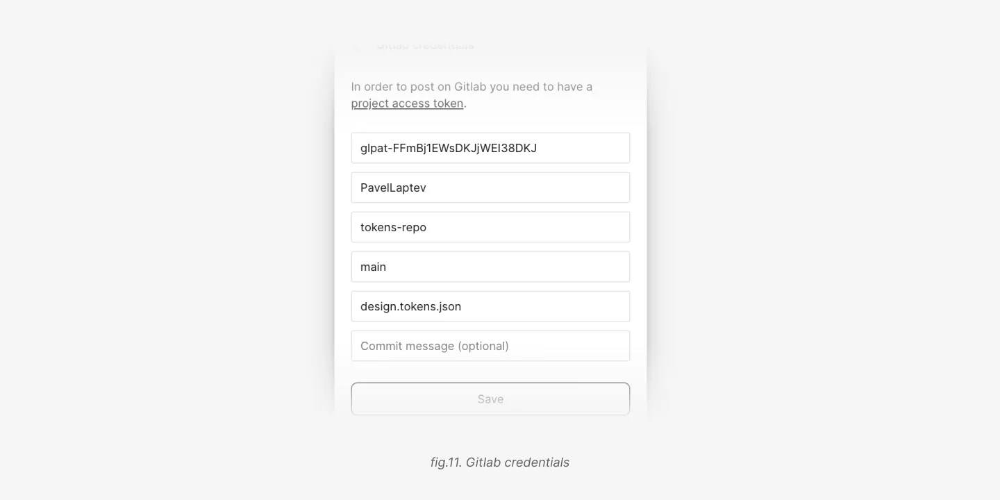

### Custom server

There is a possibilty to connect a custom server. In order to do that you need to specify a URL, a method (by default it's `POST`) and headers.

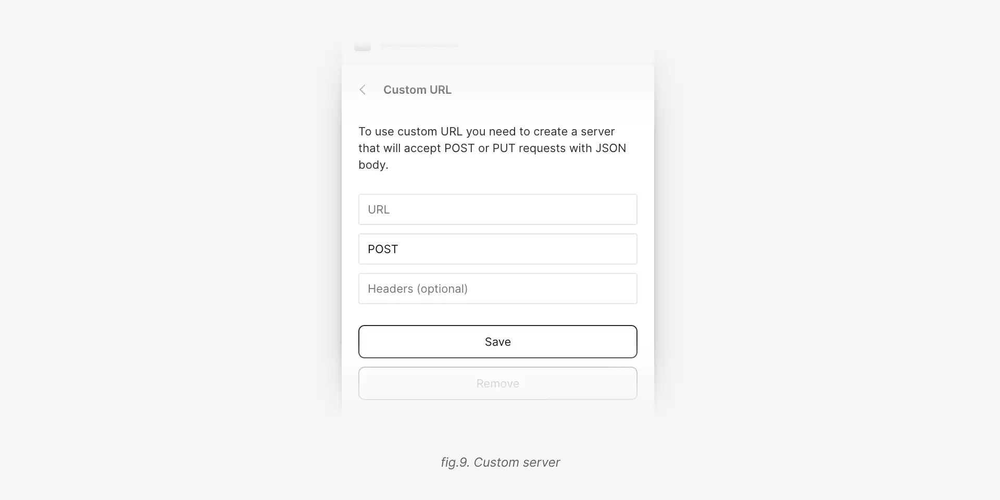

---

## Show output

If you want to see the generated JSON, you can enable the `Show output` option. The plugin will show the JSON in a code preview sidebar with:

- Syntax highlighting that matches the Figma theme
- Line numbers and code folding for collapsing groups
- Search with match highlighting
- A `Copy` button to copy the whole JSON to the clipboard
- A stats bar showing the number of tokens, groups, lines, and the file size

The output doesn't update automatically, in order to optimize the performance. So, if you want to see the updated JSON, you need to click the `Update` button.

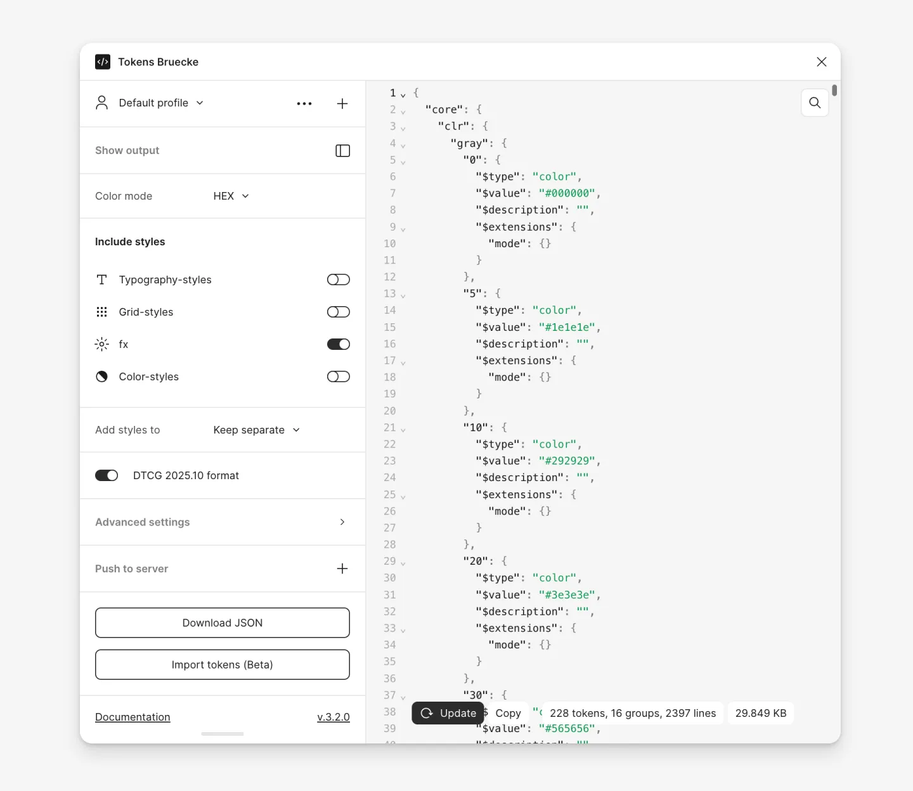

---

## Plugin window height

The plugin window auto-fits the height of its content, but you can adjust it manually using the resizer handle at the bottom of the settings view.

- **Drag** the handle up or down to set a custom height. The minimum is `360px` and the maximum is the current content height — you can't grow the window beyond what's actually there.
- **Double-click** the handle to reset back to auto-fit. The window snaps to match the content height again.
- Your manual height is preserved while the output preview is open, so you can resize both with and without the preview showing.

---

## Multiple profiles

The plugin supports multiple named profiles. Each profile stores its own complete set of export settings and server configurations, so you can switch between different setups without reconfiguring every time.

**Profile management controls** appear in the header of the settings view:

- **Profile dropdown** — shows the currently active profile. Click to switch to another profile.
- **`+` button** — creates a new profile. Enter a name and click **Create**. The new profile starts with default settings.
- **`⋮` button** — opens the active profile's detail view where you can rename or delete it.

> [!NOTE]
> Each profile's settings are saved independently. Switching profiles immediately applies that profile's export options and server credentials.

> [!WARNING]
> The last remaining profile cannot be deleted.


---

## Config autosaving

The plugin saves the config automatically. So, you don't need to set it up every time you run the plugin.

---

## Styles support

The plugin can support some styles and effects too. Until Figma will support all the styles and effects, the plugin will convert them into the corresponding design tokens types. But it's not a backward compatibility, it's a temporary solution until Figma will support all the styles and effects as variables.

Supported styles:

- Typography
- Colors
- Grids
- Shadows (including `inset` shadows)
- Blur (including `background` and `layer` blur)

### Typography

```json
"extralight": {
  "type": "typography",
  "value": {
    "fontFamily": "Inter",
    "fontWeight": 400,
    "fontSize": "18px",
    "lineHeight": "28px",
    "letterSpacing": "0%"
  },
  "description": "",
  "extensions": {
    "styleId": "S:0ffe98ad785a13839980113831d5fbaf21724594,"
  }
}
```

### Colors

The plugin supports solid colors and gradients (linear, radial, angular, diamond). Color styles are converted to DTCG format with support for variable aliases.

```json
// Solid color
"primary": {
  "type": "color",
  "value": "#ff0000"
}

// Solid color with variable alias
"secondary": {
  "type": "color",
  "value": "{colors.base.primary}"
}

// Gradient
"skeleton-ramp": {
  "type": "gradient",
  "value": [
    {
      "color": "{clr.scale.ntrl.80}",
      "position": 0
    },
    {
      "color": "{clr.scale.ntrl.95}",
      "position": 0.5
    },
    {
      "color": "#eae9e8",
      "position": 1
    }
  ]
}
```

### Grids

In Figma you can add as many grids in the style as you want. But the plugin will take only first two grids and treat the first one as `column` grid and the second one as `row` grid.

```json
// Column grid
"1024": {
  "type": "grid",
  "value": {
    "columnCount": 12,
    "columnGap": "20px",
    "columnMargin": "40px"
  }
}

// Row grid
"1024": {
  "type": "grid",
  "value": {
    "rowCount": 12,
    "rowGap": "20px",
    "rowMargin": "40px"
  }
}

// Both grids
"1024": {
  "type": "grid",
  "value": {
    "columnCount": 12,
    "columnGap": "20px",
    "columnMargin": "40px",
    "rowCount": 12,
    "rowGap": "20px",
    "rowMargin": "40px"
  }
}
```

### Shadows

The plugin supports `drop-shadow` and `inner-shadow` effects. If the effect is `inner-shadow`, the plugin will set the `inset` property to `true`.

```json
"xl": {
  "type": "shadow",
  "value": {
    "inset": false,
    "color": "#0000000a",
    "offsetX": "0px",
    "offsetY": "10px",
    "blur": "10px",
    "spread": "-5px"
  }
}
```

### Blur

The plugin supports `background` and `layer` blur effects. In order to distinguish between them, the plugin adds the `role` property to the generated JSON.

```json
// Background blur
"sm": {
  "type": "blur",
  "value": {
    "role": "background",
    "blur": "4px"
  }
}

// Layer blur
"md": {
  "type": "blur",
  "value": {
    "role": "layer",
    "blur": "12px"
  }
}
```

### Multiple `Shadow` and `Blur` styles support

If the style has multiple `Shadow` or `Blur` styles, the plugin will add them into the array.

```json
"new-sh": {
  "$type": "shadow",
  "$value": [
    {
      "inset": false,
      "color": "#e4505040",
      "offsetX": "0px",
      "offsetY": "4px",
      "blur": "54px",
      "spread": "0px"
    },
    {
      "inset": false,
      "color": "#5b75ff40",
      "offsetX": "0px",
      "offsetY": "4px",
      "blur": "24px",
      "spread": "0px"
    },
    {
      "inset": false,
      "color": "#00000040",
      "offsetX": "0px",
      "offsetY": "4px",
      "blur": "4px",
      "spread": "0px"
    }
  ]
}
```

---

## Tokens structure

Plugin first takes the `collection` name, then the `group` and then the `variable` name (fig.1).
Mode variables will be wrapped under the `$extensions` objects

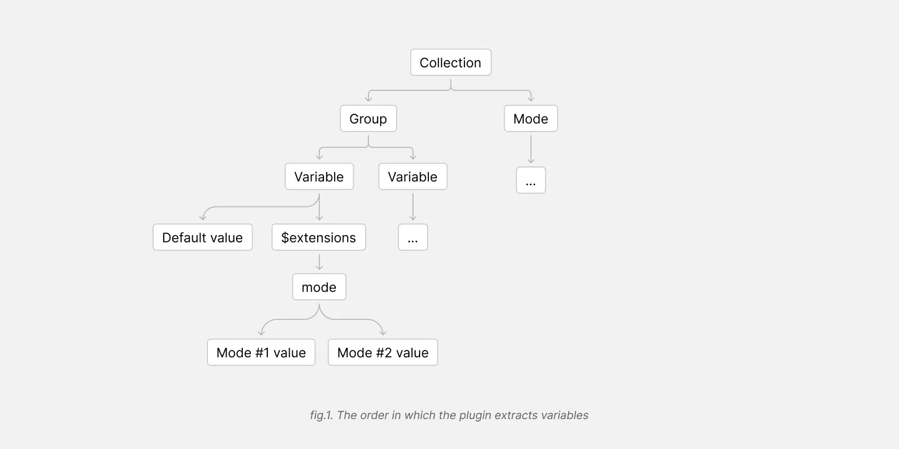

For example, if you have a collection named `clr-theme`, mode named `light` and variable named `dark`, the plugin will generate the following JSON:

```json
"clr-theme": {
  "container-outline/mid": {
    "type": "color",
    "value": "{clr-core.ntrl.40}",
    "description": "",
    "$extensions": {
      "mode": {
        "light": "{clr-core.ntrl.40}",
        "dark": "{clr-core.ntrl.55}"
      }
    }
  }
}
,
```

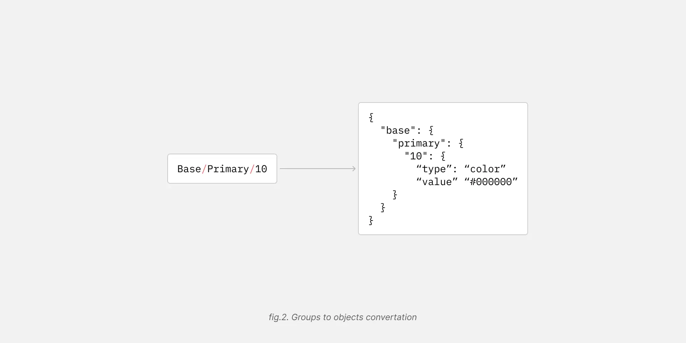

Figma automatically merges groups and their names into a single name, e.g. `Base/Primary/10` (fig.2). In this case, the plugin will generate the following JSON:

```json
{
  "base": {
    "primary": {
      "10": {
        "type": "color",
        "value": "#000000"
      }
    }
  }
}
```

## Aliases handling

All aliases are converted into the alias string format from the [Design Tokens specification](https://design-tokens.github.io/community-group/format/#aliases-references).

```json
{
  "button": {
    "background": {
      "type": "color",
      "value": "{colors.primary.10}"
    }
  }
}
```

### Include `.value` string for aliases

You can switch on the `Include .value string for aliases` option in [the plugin settings](#include-value-string-for-aliases).

---

### Color aliases with opacity

Since September 2026 Figma lets a color variable alias another color and apply its own opacity on top ("Control opacity at scale"). The opacity can be a plain percentage or a number variable with the `COLOR_OPACITY` scope.

The [DTCG color type](https://www.designtokens.org/tr/2025.10/color/#format) has no way to express "this color, with that opacity" while keeping the reference, so the plugin exports these variables as a composite value: `components` holds the reference to the base color and `alpha` holds the opacity, as a `0..1` number (or `"50%"` with [Use percentage for opacity](#use-percentage-for-opacity)) or a reference to the number variable driving it.

```json
{
  "opacity": {
    "50": { "$type": "number", "$value": 0.5, "scopes": ["COLOR_OPACITY"] }
  },
  "color": {
    "brand": {
      "$type": "color",
      "$value": { "colorSpace": "srgb", "components": [0.2, 0.4, 0.8], "alpha": 1, "hex": "#3366cc" }
    },
    "brand-translucent": {
      "$type": "color",
      "$value": { "components": "{color.brand}", "alpha": 0.5 }
    },
    "brand-muted": {
      "$type": "color",
      "$value": { "components": "{color.brand}", "alpha": "{opacity.50}" }
    }
  }
}
```

The `alpha` replaces the alpha channel of the referenced color. If the base color is a literal rather than an alias, the opacity is baked into the regular color value for the chosen [color mode](#color-mode); only when the opacity itself is a reference does the color value keep an `alpha` (or `a`) reference in place of the number.

> [!NOTE]
> This shape is an extension of the DTCG format, so a consumer needs a small custom transform: resolve the `components` reference, then apply `alpha`. Figma's Plugin API can read these variables but not write them yet, so they cannot be imported back through the plugin.

---

### Handle variables from another file

Imagine you have a library from another file with "base" variables. And you use this variables in your current file.

The plugin will generate the alias name anyway, but it will be a path to the variable as if it was in the current file.

```json
{
  "button": {
    "background": {
      "type": "color",
      "value": "{colors.primary.10}"
    }
  }
}
```

The plugin wouldn't include the variable into the generated JSON in order to avoid duplicates or conflicts with JSON files you can generate from another Figma files.

So you will need to merge the file with the base variables from one file with another where you use them. Otherwise tools like Style Dictionary wouldn't be able to resolve the aliases.

---

### Handle modes

If there is only one mode — the plugin wouldn't include it in a generated JSON.
If there are multiple modes, the plugin will place them under the `$extensions` objects.

It follows the same pattern as used by [Cobalt](https://cobalt-ui.pages.dev/guides/modes#with-modes)

---

## Variables types conversion

Unlike design tokens, Figma variables [support only 6 types](https://www.figma.com/plugin-docs/api/VariableResolvedDataType) — `COLOR`, `BOOLEAN`, `FLOAT`, `STRING`, `TIMING` and `EASING`. So, the plugin converts them into the corresponding types from the [DTCG 2025.10 specification](https://www.designtokens.org/tr/2025.10/format/#types).

| Figma type | Scope condition          | Design Tokens type                                                           |
| ---------- | ------------------------ | ---------------------------------------------------------------------------- |
| COLOR      | —                        | [color](https://www.designtokens.org/tr/2025.10/format/#color)               |
| BOOLEAN    | —                        | _boolean_ \*                                                                 |
| FLOAT      | `FONT_WEIGHT` scope      | [fontWeight](https://www.designtokens.org/tr/2025.10/format/#font-weight) \* |
| FLOAT      | `OPACITY` scope (no %)   | _number_ \*                                                                  |
| FLOAT      | `OPACITY` scope (with %) | _string_ (e.g. `"10%"`) \*                                                   |
| FLOAT      | all other scopes         | [dimension](https://www.designtokens.org/tr/2025.10/format/#dimension) \*\*  |
| STRING     | —                        | _string_ \*                                                                  |
| TIMING     | —                        | [duration](https://www.designtokens.org/tr/2025.10/format/#duration) \*\*\*   |
| EASING     | —                        | [cubicBezier](https://www.designtokens.org/tr/2025.10/format/#cubic-bezier) or _string_ \*\*\*\* |

\* native JSON types — not part of the closed DTCG 2025.10 type set. With the [DTCG 2025.10 format](#dtcg-202510-format) setting on, `$type` is omitted for `string`/`boolean` tokens and the original Figma type is preserved under `$extensions.figmaType`. Also see [this issue](https://github.com/design-tokens/community-group/issues/120#issuecomment-1279527414).

\*\* Figma currently supports only `FLOAT` for numeric values used as dimensions, which map to `px` units. With the DTCG 2025.10 format on, dimensions are exported as `{ "value": 6, "unit": "px" }` objects; otherwise the plugin appends `px` to the number.

\*\*\* Figma stores timings in seconds; the plugin converts them to milliseconds. With the DTCG 2025.10 format on, durations are exported as `{ "value": 300, "unit": "ms" }` objects; otherwise the plugin appends `ms` to the number.

\*\*\*\* See [Motion variables](#motion-variables) below.

---

## Motion variables

Figma's `EASING` variables hold either a custom curve or one of Figma's presets. The API returns numbers only for the two custom types — every preset arrives as just a name — so the plugin maps them like this:

| Figma easing                                                                         | Token type            | Example value              |
| ------------------------------------------------------------------------------------ | --------------------- | -------------------------- |
| Custom bezier                                                                          | `cubicBezier`         | `[0, 0, 0.58, 1]`          |
| Linear, Ease in / out / in and out, Ease in / out / in and out back                    | `cubicBezier`         | `[0.41, 0, 1, 1]`          |
| Linear, Ease in / out / in and out, Ease in / out / in and out back — expansion off    | `string`              | `"ease-in"`                |
| Gentle, Quick, Bouncy, Slow                                                            | `string`              | `"gentle"`                 |
| Custom spring                                                                          | `string`              | `"spring(bounce 0.35)"`    |
| Hold                                                                                   | `string`              | `"hold"`                   |

Named bezier presets are expanded into curves unless [Expand easing presets to cubic-bezier](#expand-easing-presets-to-cubic-bezier) is turned off. Springs and Hold are always names: DTCG has no spring type, and Figma exposes no numbers for them.

All of these forms are read back on import, so a round trip through the plugin preserves the original preset — including expanded curves, which are matched back to the preset they came from. Springs and Hold are the exception: they are indistinguishable from ordinary text on the way back in, so importing them creates `STRING` variables rather than `EASING` ones.

> [!NOTE]
> Figma does not publish the control points behind its named bezier presets, and the plugin API does not return them. The curves the plugin expands to are taken from Figma's own custom-bezier editor; if one of them does not match what you see in your file, please [open an issue](https://github.com/tokens-bruecke/figma-plugin/issues).

---

## Design tokens types

In order to validate types, the plugin uses the [Design Tokens types](https://github.com/tokens-bruecke/figma-plugin/blob/main/plugin-types.d.ts).

---

## Scopes lemitations

In order to convert `FONT-WEIGHT` and `OPACITY` types into valid values you should specify them as scopes in the Figma variables. The plugin will read the first scope and convert it into the valid value. If there are multiple scopes, the plugin will take the first one.

- `FONT_WEIGHT` scope will be converted into `fontWeight` type.
- `OPACITY` scope will be converted into `number` type (or `string` with `%` if "Use percentage for opacity" is enabled).

---

## Privacy and analytics

The plugin counts a few anonymous usage events with [GoatCounter](https://www.goatcounter.com), a privacy-friendly, open-source counter. It helps us see which features are used so we know where to focus.

What is sent: the plugin was opened, the file had variables or not, tokens were downloaded, tokens were copied from the code preview, tokens were imported, or a push to one of the servers (GitHub, GitLab, JSONBin, custom URL) was started. That is the full list.

What is never sent: your tokens, variable or collection names, file names, server URLs, access tokens, or any other data read from your Figma file. GoatCounter sets no cookies and does not track you across sites.

---

## Feedback

If you have any questions or suggestions, feel free to [create an issue](https://github.com/tokens-bruecke/figma-plugin/issues)
